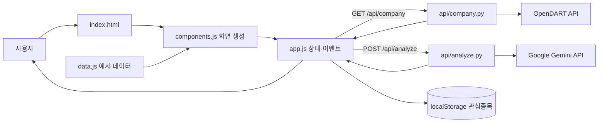

# DeepCheck 코드 구조와 문법 안내서

이 문서는 프로젝트 전체 구조, 데이터 흐름, 직접 정의한 모든 함수와 핵심 문법을 설명합니다.

## 1. 전체 구조도



`index.html`이 무대를 만들고, `components.js`가 화면을 그리며, `app.js`가 클릭과 검색을 처리합니다. 비밀 키가 필요한 외부 요청은 Python 서버가 대신 보냅니다.

## 2. 파일별 역할

```text
index.html             공통 머리글·메뉴·앱 진입점
css/style.css          색, 글꼴, 표, 레이아웃, 반응형 규칙
js/data.js             기업·재무·필터·용어 예시 데이터
js/components.js       화면 HTML을 만드는 렌더 함수
js/app.js              상태, 이벤트, 검색, 저장, API 통신
api/company.py         OpenDART 조회와 재무비율 계산
api/search.py          OpenDART 전체 기업 목록 검색
api/analyze.py         Gemini 프롬프트·요청·응답 처리
vercel.json            정적 파일과 Python API 배포 경로
requirements.txt       외부 Python 패키지 없음
```

## 3. 주요 데이터 흐름

### 기업 검색

`searchBox()` → `bindDynamic()` → `runSearch()` → `currentCompany` 변경 → `switchView('analysis')` → `renderAnalysisView()` 순서입니다.

### 공시 데이터

`loadRealCompanyData()`가 `/api/company`를 호출합니다. `company.py`가 최근 5개 사업연도를 OpenDART에서 조회하고, `extract_financials()`와 `ratio()`가 수치를 정리합니다. `applyRealCompanyData()`가 화면의 차트와 지표를 실제 값으로 교체합니다.

### AI 분석

`runAI()`가 회사명을 JSON으로 전송합니다. `analyze.py`의 `build_prompt()`가 지시문을 만들고 `request_analysis()`가 Gemini를 호출합니다. `extract_output_text()`가 문장을 꺼내 화면의 분석 문단을 교체합니다.

### 관심종목·용어사전

관심종목 ID 배열은 `localStorage`에 저장되고, 해제 시 5초 동안 되돌릴 수 있습니다. 선택 용어는 `sessionStorage`에 잠시 저장되어 용어사전에서 먼저 표시됩니다.

## 4. JavaScript 데이터와 함수 전체 목록

### `js/data.js`

| 이름 | 역할 |
|---|---|
| `Companies` | 상세 분석 지원 기업의 요약·점수·강점·위험 |
| `Financials` | 5개년 차트 기본값. 공시 성공 시 교체 |
| `Health` | 부채비율·유동비율·ROE·영업이익률·FCF 설명 |
| `FindResults` | 비교 표와 필터용 5개 기업 행 데이터 |
| `FilterItems` | 종목찾기 필터 ID와 표시 문구 |
| `GlossaryTerms` | 용어, 한글명, 정의, 해석 예시, 확인 사항 |

### `js/components.js`

| 함수 | 역할 |
|---|---|
| `searchBox(id)` | 검색 입력과 버튼 HTML 생성 |
| `watchButton(id, compact)` | 저장 상태에 맞는 추가/해제 버튼 생성 |
| `termButton(term)` | 용어사전 이동 버튼 생성 |
| `companyRow(c)` | 비교 표 한 행 생성 |
| `companyTable(results)` | 공통 비교 표와 모바일 안내 생성 |
| `renderHomeView()` | 홈과 빠른 비교 화면 |
| `renderSearchView()` | 검색 전용 화면 |
| `renderAnalysisView(c)` | 종합점수, AI, 차트, 지표, 위험 화면 |
| `renderFindView(items, results)` | 조건 필터와 결과 화면 |
| `renderGlossaryView()` | 선택 용어 우선 정렬과 전체 사전 |
| `renderWatchlistView(list)` | 저장 기업 표 또는 빈 상태 |

### `js/app.js`

| 함수 | 역할 |
|---|---|
| `switchView(view)` | 현재 화면과 URL hash 변경 |
| `renderView()` | 현재 상태에 맞는 화면 렌더링 |
| `bindDynamic()` | 새 DOM에 클릭·키보드 이벤트 연결 |
| `openCompany(id)` | 기업을 찾아 분석 화면으로 이동 |
| `runSearch(query)` | 빈 값 검사 후 이름·코드·ID 검색 |
| `isWatched(id)` | 관심종목 포함 여부 반환 |
| `saveWatchlist()` | 관심종목 배열 저장 |
| `refreshWatchControls(id)` | 동일 기업 버튼 상태 동기화 |
| `toggleWatch(id)` | 추가/해제와 해제 되돌리기 |
| `bindGlossaryTracking()` | 스크롤 위치에 맞춰 현재 용어를 갱신하고 중복 감지기를 방지 |
| `openGlossary(term)` | 선택 용어 저장 후 사전 이동 |
| `updateCount()` | 상단 관심종목 개수 갱신 |
| `applyFilter(id)` | 선택 조건으로 기업 목록 필터링 |
| `renderChart()` | 배열을 막대 차트 DOM으로 변환 |
| `formatTrillion(value)` | 원 단위 숫자를 조원 문자열로 변환 |
| `indicatorState(value, good, bad, inverse)` | 수치를 우수·보통·주의로 변환 |
| `setDataBanner(message, type)` | 공시 로딩·성공·오류 안내 생성 |
| `applyRealCompanyData(data)` | API 수치로 차트·지표 교체 |
| `loadRealCompanyData()` | OpenDART 요청, 캐시, 실패 처리 |
| `runAI(company)` | Gemini 요청, 25초 제한, 상태 처리 |
| `showToast(message, action)` | 5초 알림과 선택적 액션 생성 |

주요 전역 상태는 `currentView`, `currentCompany`, `watchlist`, `realDataCache`, `glossaryScrollHandler`입니다. `glossaryScrollHandler`는 용어사전을 다시 방문할 때 이전 스크롤 이벤트를 제거하기 위해 별도로 보관합니다.

## 5. Python 함수와 클래스 전체 목록

### `api/analyze.py`

| 함수/메서드 | 역할 |
|---|---|
| `build_prompt(company)` | 초보자용 분석 지시문 생성 |
| `extract_output_text(payload)` | Gemini 응답 텍스트 추출 |
| `request_analysis(company, api_key, model)` | Gemini JSON 요청과 호출 |
| `handler.do_POST()` | 입력·키 검사와 성공/실패 응답 |
| `handler.do_GET()` | 허용하지 않은 GET에 405 반환 |
| `handler.send_json(status, body)` | UTF-8 JSON과 no-store 헤더 전송 |

### `api/company.py`

| 함수/메서드 | 역할 |
|---|---|
| `number(value)` | 쉼표가 있는 문자열을 안전하게 정수 변환 |
| `find_account(rows, names, statement)` | 재무제표 종류와 계정명으로 금액 검색 |
| `extract_financials(rows)` | 매출·이익·자산·부채·현금흐름·FCF 추출 |
| `ratio(numerator, denominator)` | 0으로 나누지 않고 백분율 계산 |
| `fetch_year(api_key, corp_code, year)` | 특정 연도 연결재무제표 조회 |
| `handler.do_GET()` | 입력 검사, 5개년 조회, 지표 계산 |
| `handler.send_json(status, body)` | UTF-8 JSON과 캐시 헤더 전송 |

### `api/search.py`

| 함수/메서드 | 역할 |
|---|---|
| `load_companies(api_key)` | OpenDART 기업 고유번호 ZIP/XML을 읽어 메모리에 캐시 |
| `search_companies(companies, query, limit)` | 정확·앞부분·포함 일치 순으로 검색 |
| `handler.do_GET()` | 검색어 검사와 전체 기업 검색 결과 반환 |
| `handler.send_json(status, body)` | UTF-8 JSON과 캐시 헤더 전송 |

## 6. 사용한 JavaScript 문법

| 문법 | 용도 |
|---|---|
| `const`, `let` | 고정 값과 바뀌는 상태 선언 |
| 배열 `[]`, 객체 `{}` | 기업 목록과 속성 표현 |
| 화살표 함수 `x => ...` | 짧은 콜백과 렌더 보조 함수 |
| 템플릿 리터럴 `` `${value}` `` | HTML 문자열에 값 삽입 |
| spread `...array` | 배열 값을 펼쳐 기존 배열 갱신 |
| `map()` / `filter()` / `find()` | 변환 / 조건 추림 / 첫 항목 검색 |
| `includes()` | 지원 화면·관심종목 포함 검사 |
| optional chaining `?.` | 값이 없을 때 오류 없이 중단 |
| nullish coalescing `??` | null·undefined일 때 대체값 사용 |
| ternary `조건 ? A : B` | 상태별 문구·클래스 선택 |
| 정규식 `/회복|성장/` | 여러 키워드 검사 |
| DOM API | `querySelector`, `createElement`, `classList`, `dataset` |
| 이벤트 | `onclick`, `onkeydown`, Enter 키 처리 |
| Web Storage | `localStorage`, `sessionStorage` |
| `async`/`await`, `fetch()` | 내부 API를 비동기로 호출 |
| `try`/`catch`/`finally` | 성공·오류·마무리 분리 |
| `AbortController` | 25초 뒤 AI 요청 중단 |
| `Map` | 종목코드별 공시 응답 캐시 |
| `JSON.parse/stringify` | 문자열과 데이터 상호 변환 |

## 7. 사용한 Python 문법

| 문법 | 용도 |
|---|---|
| `import` | JSON, 환경 변수, URL, 날짜, HTTP 기능 사용 |
| `def` / `return` | 함수 정의와 결과 반환 |
| `class handler(BaseHTTPRequestHandler)` | Vercel HTTP 요청 처리 클래스 |
| 딕셔너리·리스트·세트 | 회사 매핑, 연도별 결과, 계정명 관리 |
| `for` / `if` | 행·연도 반복과 조건 검사 |
| `try` / `except` | 입력·숫자·네트워크 오류 처리 |
| `with urlopen(...)` | 응답 사용 후 안전하게 닫기 |
| f-string `f"{value}"` | URL·문구에 값 삽입 |
| `**data` | 딕셔너리 키·값 펼치기 |
| `os.environ.get` | 비밀 키를 소스 밖에서 읽기 |
| HTTP 상태 코드 | 200, 400, 404, 405, 429, 500, 502, 503, 504 구분 |

## 8. HTML·CSS·접근성

- 의미 있는 `header`, `main`, `nav` 구조와 `lang="ko"`, viewport를 사용합니다.
- `aria-label`, `aria-pressed`, `aria-busy`, `aria-live`로 상태를 전달합니다.
- CSS 변수는 색과 모서리를 통일하고, Grid는 큰 배치, Flexbox는 작은 행 배치를 맡습니다.
- 820px·640px 미디어 쿼리가 모바일 레이아웃과 하단 메뉴를 조정합니다.
- 표는 작은 화면에서 `overflow-x:auto`로 좌우 스크롤합니다.

## 9. 보안·오류·현재 한계

- API 키는 `.env.local`과 Vercel 환경 변수에만 둡니다.
- Gemini 문장은 `textContent`로 넣어 HTML로 실행되지 않게 합니다.
- 빈 입력·80자 초과·네트워크·사용량 초과·시간 초과를 구분합니다.
- OpenDART 실패 시 예시 재무 데이터를 유지합니다.
- 관심종목은 현재 브라우저에만 저장됩니다.
- 5개 기업은 빠른 비교 예시이며 검색은 OpenDART 등록 기업 전체를 대상으로 합니다. 사업보고서가 없거나 계정 구조가 다른 기업은 일부 수치가 표시되지 않을 수 있습니다.
- 실시간 주가를 제공하지 않으며 투자 권유 서비스가 아닙니다.
